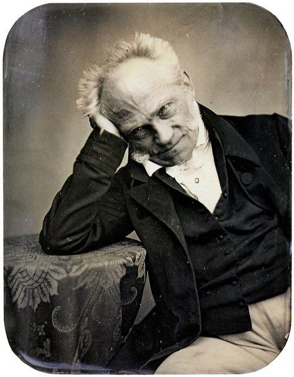

First a quote from a more recent scholar[^1]: "Philosophy has long suffered, as
hard sciences have not, from a wavering consensus on questions of professional
competence. Students of the heavens are separable into astronomers and
astrologers as readily as are the minor domestic ruminants into sheep and goats,
but the separation of philosophers into sages and cranks seems to be more
sensitive to frames of reference. This is perhaps as it should be, in view of
the unregimented and speculative character of the subject."

Arthur Schopenhauer's 'On University Philosophy' is one of the funnier essays written by any philosopher. It had been published in 1851, but not easy to find in English, as a good translation of the book it came out in, *Parerga and Paralipomena*, appeared [only recently](https://www.cambridge.org/us/academic/subjects/philosophy/nineteenth-century-philosophy/schopenhauer-parerga-and-paralipomena-short-philosophical-essays-volume-1?format=HB&isbn=9780521871389#contentsTabAnchor).

In the piece, Schopenhauer ripped his university fellow Hegel, and the way philosophy was taught in Germany at the time. The essay at first reads almost like a satire, to quickly turn into perhaps a true picture of a permanent condition: professional philosophers -that work at universities- are **not free to think**, since they are **paid to teach**. Sour grapes (Schopenhauer couldn't keep his teaching position), however, he did bring up an issue that never really went away.

[^1]: 'Has Philosophy Lost Contact with People?’ by W.V. Quine, 1981, in [Theories and Things](https://www.hup.harvard.edu/catalog.php?isbn=978067487926), pp. 190-3

 

Images
------

