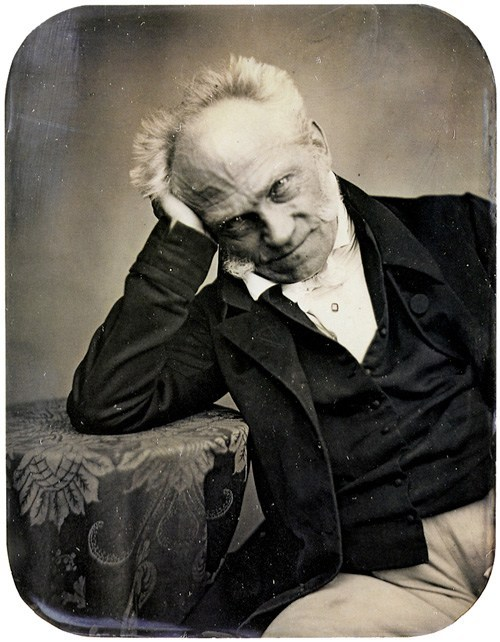

First a quote from a more recent scholar[^1]: "Philosophy has long suffered, as
hard sciences have not, from a wavering consensus on questions of professional
competence. Students of the heavens are separable into astronomers and
astrologers as readily as are the minor domestic ruminants into sheep and goats,
but the separation of philosophers into sages and cranks seems to be more
sensitive to frames of reference. This is perhaps as it should be, in view of
the unregimented and speculative character of the subject."

[^1]: Willard Quine (In [Theories and
Things](https://www.hup.harvard.edu/catalog.php?isbn=978067487926), 1979), 'Has
Philosophy Lost Contact with People?’

 

Images
------

